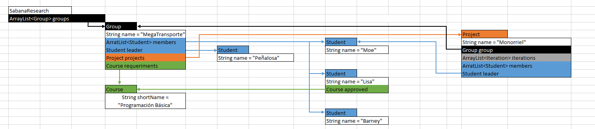
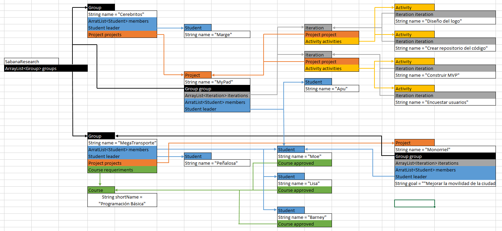

# Parcial-1
Primer parcial de POO.

# I. Memoria

* ### Mapa de memoria parte 1

  
* ### Mapa de memoria parte 2

* ### Mapa de memoria Completo

# V. Conceptos
### 1. Encapsulamiento:
Encapsulamiento es mantener una información constante, 
así se evita que otras clases modifiquen la información y para mantener uso 
único a cada clase.

### 2. Ocultamiento
El ocultamiento es mantener la información escondida de otras clases.